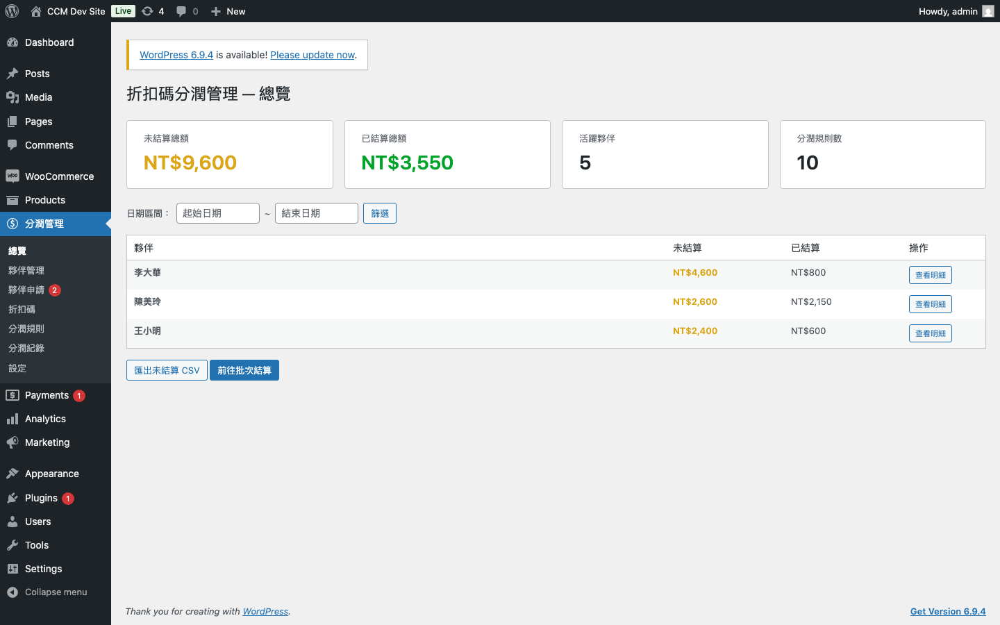
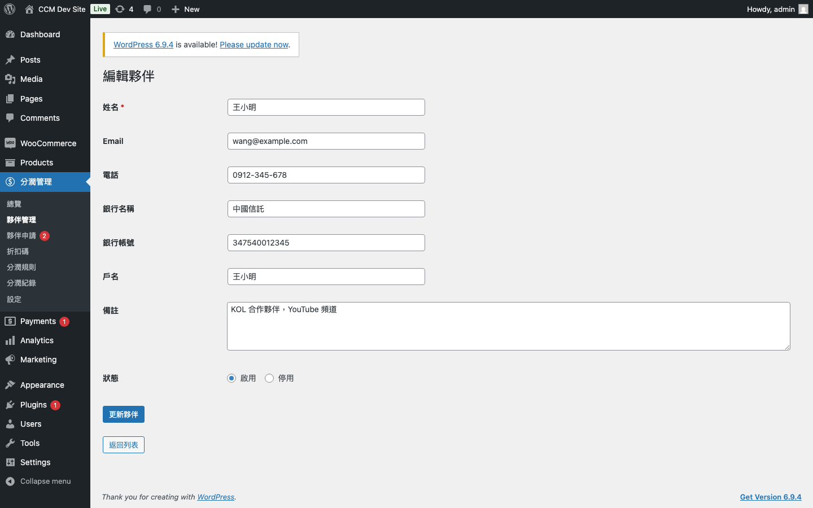
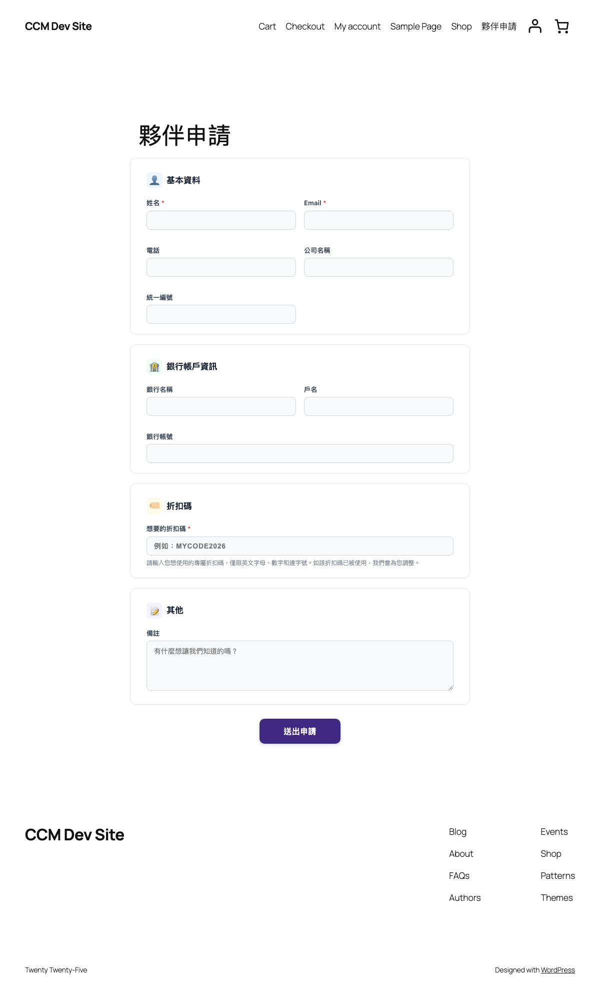
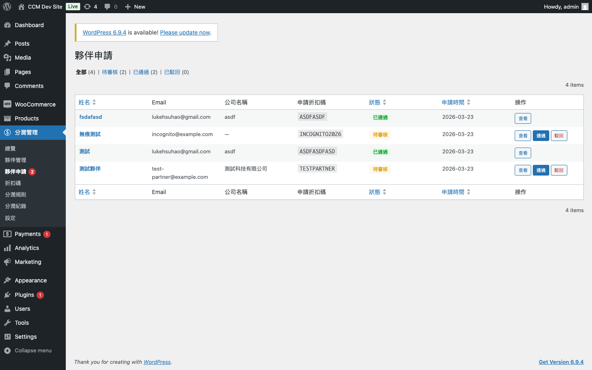
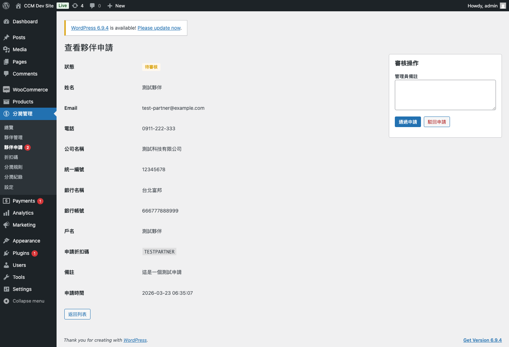
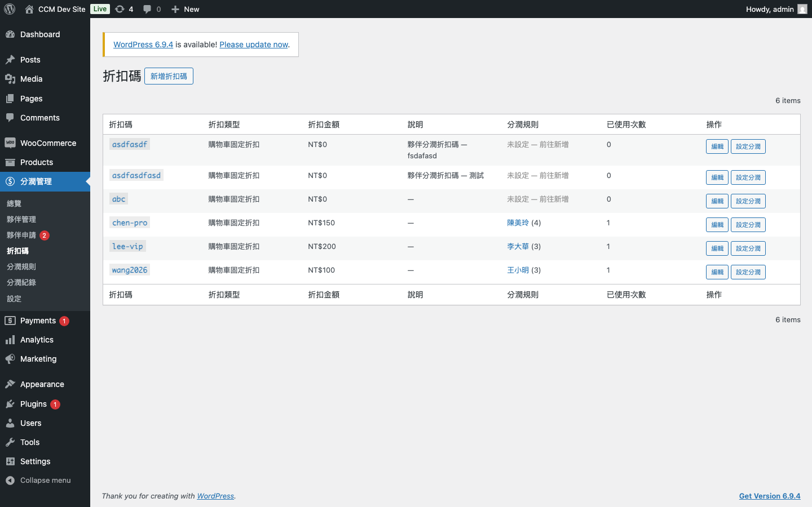
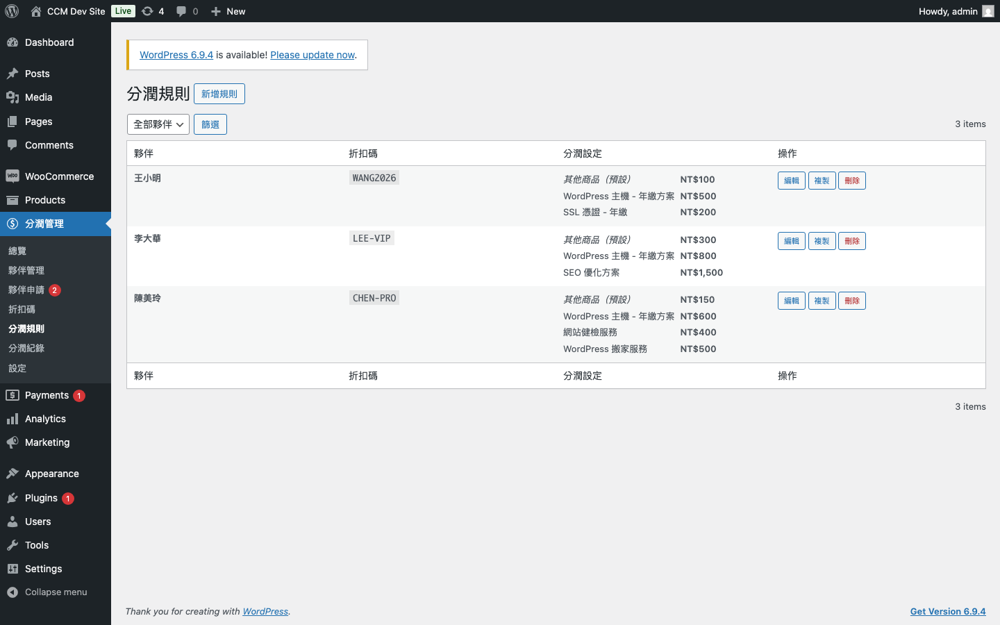
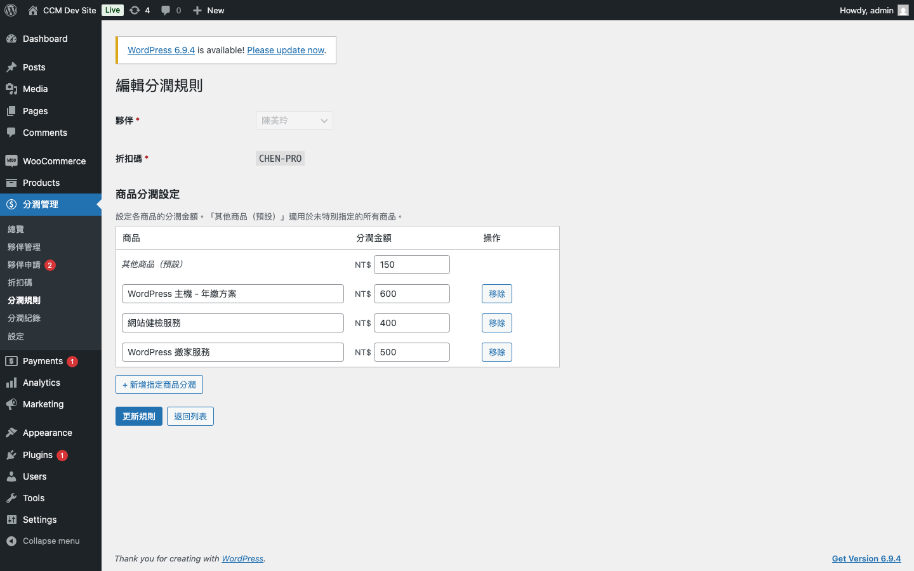
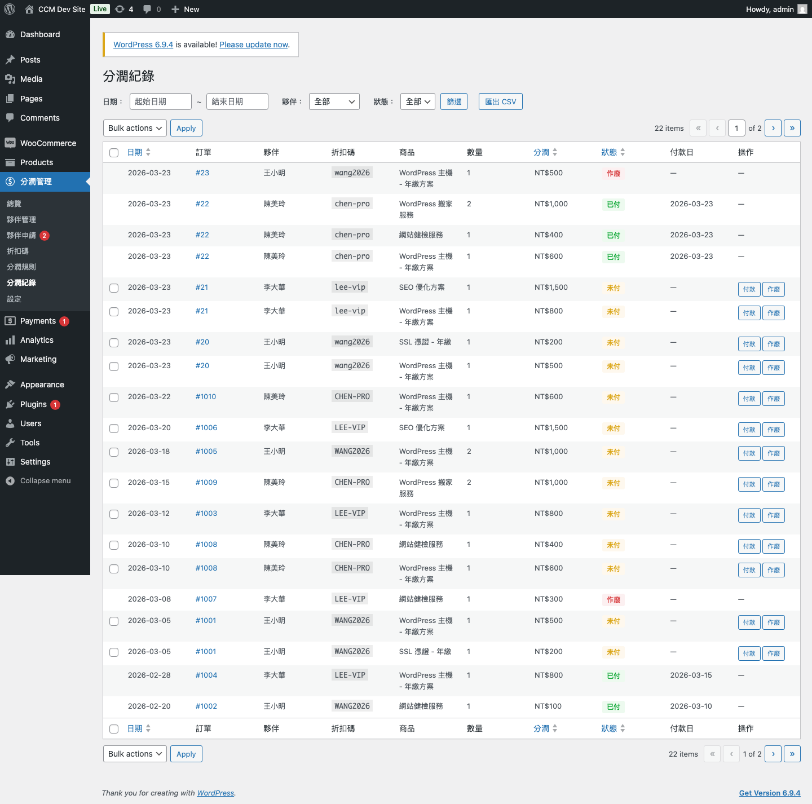
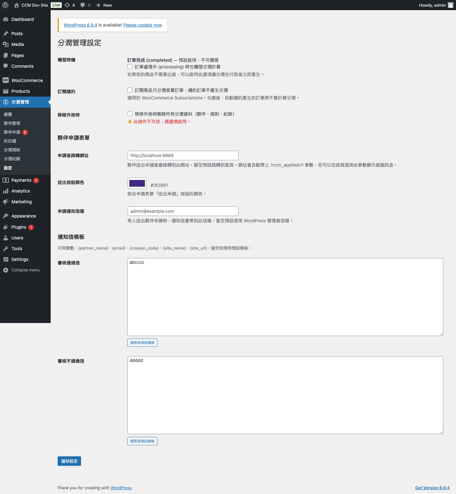

# WooCommerce 折扣碼分潤管理 — Coupon Commission Manager

WooCommerce 折扣碼分潤管理外掛，專為透過折扣碼進行分潤的使用情境設計。

**Author:** [Powerhouse](https://powerhouse.cloud)

你只需要建立夥伴、指定折扣碼、設定每個商品的分潤金額，當顧客使用折扣碼下單並完成付款後，系統會自動產生分潤紀錄。後台可以一目了然地查看每位夥伴的未結算金額、批次標記已付、匯出 CSV 給會計。

---

## 系統需求

- PHP 7.4+
- WordPress 5.8+
- WooCommerce 6.0+
- 支援 HPOS（High-Performance Order Storage）— 開啟或關閉皆相容
- 可選整合 WooCommerce Subscriptions

---

## 安裝方式

### 方法一：上傳 ZIP
1. 從 [Releases](https://github.com/lukehsuhao/coupon-commission-manager/releases) 下載最新版 ZIP
2. WordPress 後台 → 外掛 → 安裝外掛 → 上傳外掛 → 選擇 ZIP 檔 → 安裝
3. 啟用外掛（自動建立資料表）

### 方法二：手動上傳
1. 將 `coupon-commission-manager/` 資料夾上傳到 `wp-content/plugins/`
2. 後台啟用外掛

啟用後，左側選單會出現「分潤管理」。

---

## 功能總覽

### 總覽 Dashboard

四張摘要卡片一頁掌握全局：未結算總額、已結算總額、活躍夥伴數、分潤規則數。下方依夥伴分組顯示未結算與已結算統計，支援日期區間篩選，可一鍵匯出未結算 CSV 或前往批次結算。

### 夥伴管理

新增 / 編輯分潤夥伴，記錄姓名、Email、電話、銀行帳號、戶名、備註。列表直接顯示完整銀行資訊、折扣碼數、未結算與已支付金額。支援啟用 / 停用（軟刪除），有紀錄的夥伴不可硬刪。

### 夥伴申請（前台）

透過 Shortcode `[ccm_partner_apply]` 在任意頁面建立申請表單。潛在夥伴可自行填寫基本資料、銀行帳戶、想要的折扣碼等資訊送出申請。表單採卡片式現代設計，支援 RWD 自適應，登入及未登入用戶皆可使用。

安全防護：Nonce 驗證 + Honeypot 防垃圾 + IP 頻率限制 + 重複申請檢查。

### 夥伴申請審核（後台）

所有申請集中在「夥伴申請」頁面管理，待審核數量會以 badge 顯示在選單上。支援狀態篩選（全部 / 待審核 / 已通過 / 已駁回）。

點擊「查看」可檢閱完整申請資料，填寫管理員備註後選擇「通過申請」或「駁回申請」：

- **通過**：自動建立夥伴 + WooCommerce 折扣碼，並寄送審核通過通知信
- **駁回**：寄送審核不通過通知信

折扣碼如果已被使用，系統會自動加上隨機後綴並在通知信中說明。

### 折扣碼管理

在外掛內直接新增 WooCommerce 折扣碼，不用切到 WooCommerce 選單。列出所有折扣碼，顯示折扣類型、金額、使用次數。分潤規則欄位直接連結到對應夥伴的規則編輯頁。

### 分潤規則

以「夥伴 + 折扣碼」為一組，一次設定多個商品的固定分潤金額。支援「其他商品（預設）」— 未特別指定的商品套用此金額。指定商品的金額**優先於預設金額**。

支援**規則複製**，將既有規則一鍵複製到新的夥伴 / 折扣碼。折扣碼搜尋欄位支援即時新增不存在的折扣碼。

### 分潤紀錄

篩選條件：日期區間、夥伴、折扣碼、付款狀態。支援單筆標記已付 / 作廢，以及批次標記已付。狀態色碼一目了然。訂單編號可直接點擊跳到 WooCommerce 訂單頁。

### 設定

**分潤觸發：**
- 訂單完成（completed）時觸發（預設）
- 可選在訂單處理中（processing）時也觸發
- 可選訂閱商品只分潤首筆訂單，續約不分潤（WooCommerce Subscriptions）

**夥伴申請表單：**
- 申請後跳轉網址（留空跳首頁，URL 自動帶 `?ccm_applied=1` 參數）
- 送出按鈕顏色（color picker）
- 申請通知信箱（有新申請時通知管理員）

**通知信模板：**
- 審核通過信 / 不通過信可自訂內容
- 支援變數：`{partner_name}`、`{email}`、`{coupon_code}`、`{site_name}`、`{site_url}`
- 「還原為預設模板」一鍵還原

---

## 使用教學

### Step 1：建立夥伴

兩種方式：

**方式一：手動建立**
前往「分潤管理 → 夥伴管理 → 新增夥伴」，填寫姓名、Email、電話、銀行帳號、戶名等資訊。

**方式二：開放申請**
建立一個 WordPress 頁面，內容放 `[ccm_partner_apply]`，將頁面連結提供給潛在夥伴。夥伴填寫申請後，你在「夥伴申請」頁面審核通過即自動建立。

### Step 2：建立折扣碼

三種方式（擇一即可）：
- 在「分潤管理 → 折扣碼 → 新增折扣碼」直接建立
- 在設定分潤規則時，折扣碼搜尋欄輸入不存在的碼，選擇「+ 建立新折扣碼」
- 審核通過夥伴申請時自動建立（使用申請人填寫的折扣碼）

如果折扣碼純粹用於分潤追蹤（不打折），折扣金額填 0 即可。

### Step 3：設定分潤規則

前往「分潤管理 → 分潤規則 → 新增規則」：

1. 選擇夥伴
2. 搜尋或建立折扣碼
3. 設定商品分潤金額：
   - **其他商品（預設）**：適用於所有未特別指定的商品
   - 點「+ 新增指定商品分潤」可針對特定商品設定不同金額
   - 指定商品的金額優先於預設金額

**範例：**

| 商品 | 分潤金額 |
|---|---|
| 其他商品（預設） | NT$150 |
| WordPress 主機 | NT$600 |
| 網站健檢服務 | NT$400 |
| WordPress 搬家服務 | NT$500 |

→ 客戶買「搬家服務」使用此折扣碼 → 分潤 NT$500（不是預設的 150）
→ 客戶買「SSL 憑證」使用此折扣碼 → 分潤 NT$150（套用預設）

**複製規則：** 如果多位夥伴的分潤金額相同，在規則列表點「複製」，選擇新的夥伴和折扣碼，商品和金額自動帶入。

### Step 4：等待訂單完成

當顧客使用有設定分潤規則的折扣碼下單，且訂單狀態變為「已完成」時，系統會自動在「分潤紀錄」中產生對應的分潤項目。不需要任何手動操作。

### Step 5：管理付款

前往「分潤管理 → 分潤紀錄」：

- 使用篩選功能找到要結算的紀錄
- 單筆點「付款」或勾選多筆後「批次標記已付」
- 點「匯出 CSV」給會計作為付款憑證

---

## 自動分潤計算

### 觸發條件

| 訂單狀態變更 | 分潤行為 |
|---|---|
| → 已完成（completed） | 自動產生分潤紀錄（未付） |
| → 處理中（processing） | 若設定中有啟用，也會觸發 |
| 已完成 → 取消 | 未付紀錄自動作廢 |
| 已完成 → 退款 | 未付紀錄自動作廢 |
| 已完成 → 保留 → 已完成 | 不會重複產生紀錄（冪等性） |

> **注意：** 已標記為「已付」的分潤紀錄不會被自動作廢（因為款項已匯出），需要手動處理。

### WooCommerce Subscriptions

在「分潤管理 → 設定」勾選「訂閱商品只分潤首筆訂單，續約訂單不產生分潤」後：

- 客戶首次訂閱下單 → 正常產生分潤
- 後續自動續約訂單 → 跳過，不產生分潤

不勾選則續約訂單也會照常產生分潤。

### CSV 匯出

- UTF-8 with BOM 編碼，Excel 開啟中文不亂碼
- 欄位：紀錄編號、日期、訂單編號、夥伴名稱、折扣碼、商品名稱、數量、單位分潤、分潤合計、狀態、付款日期、付款備註
- 支援依日期 / 夥伴 / 折扣碼 / 狀態篩選匯出

---

## 資料庫

外掛啟用時自動建立 4 張資料表：

| 資料表 | 用途 |
|---|---|
| `wp_ccm_partners` | 夥伴資料 |
| `wp_ccm_commission_rules` | 分潤規則（折扣碼 × 商品 → 金額） |
| `wp_ccm_commission_logs` | 分潤紀錄（自動產生，含快照資料） |
| `wp_ccm_applications` | 夥伴申請紀錄 |

分潤紀錄會快照折扣碼名稱、商品名稱、分潤金額，即使日後修改或刪除產品 / 折扣碼 / 規則，歷史紀錄不受影響。

---

## 移除外掛

- 預設停用外掛不會刪除資料
- 如需完全移除：前往「分潤管理 → 設定」勾選「移除外掛時刪除所有分潤資料」，然後再刪除外掛

---

## 授權

GPL-2.0-or-later
